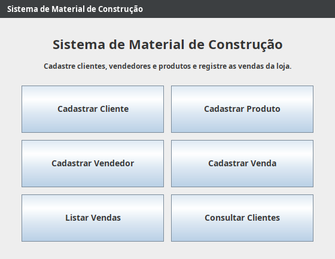
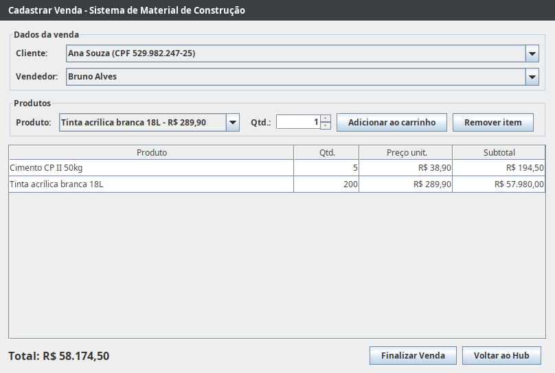
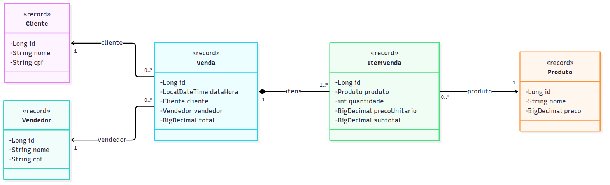
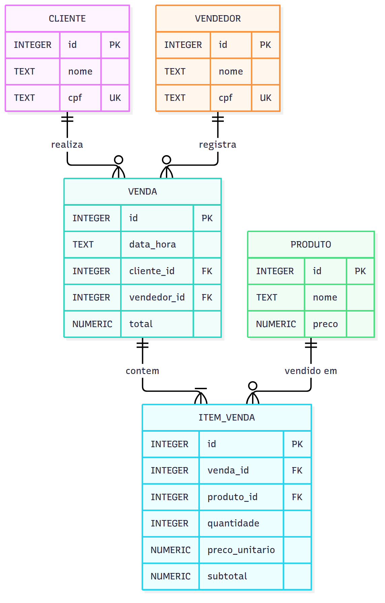
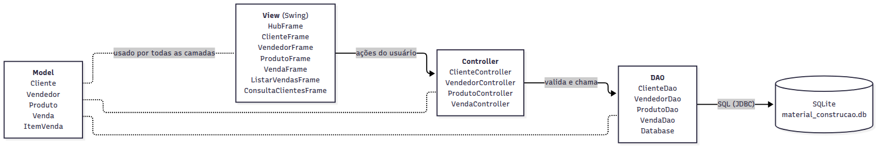

# Sistema de Material de Construção

Aplicação desktop em **Java Swing** para cadastro de clientes, vendedores e produtos e registro de vendas de uma loja de materiais de construção. Usa banco **SQLite** local via JDBC e segue o padrão **MVC**.

Trabalho da disciplina de Programação Orientada a Objetos: sistema desktop com integração com banco de dados, 4 ou mais tabelas, várias telas e padrão MVC.

## Como executar

Pré-requisitos: **Java 21** e Maven. No IntelliJ o Maven já vem embutido.

### IntelliJ IDEA

1. **File → Open** e escolha a pasta do repositório (a que tem o `pom.xml`).
2. Se aparecer *"Project JDK is not defined"*, clique em **Setup SDK** e escolha um JDK **21**. Se não tiver, use **Download JDK**.
3. Abra `src/main/java/br/edu/materialconstrucao/Main.java` e clique no ▶️ ao lado do `main`.

### Terminal

```bash
mvn test       # roda os testes
mvn exec:java  # abre o sistema
```

Na primeira execução o banco `data/material_construcao.db` é criado e, se estiver vazio, recebe **dados de exemplo**: 3 clientes, 2 vendedores, 5 produtos e 2 vendas. Para começar do zero, apague a pasta `data/`.

## Funcionalidades

- **Cadastro de clientes, vendedores e produtos:** incluir, alterar e excluir. Clique numa linha da tabela para carregar o registro no formulário e editar. O botão **Limpar** volta ao modo de novo cadastro.
- **Validações:** nome obrigatório, CPF com dígitos verificadores válidos e sem repetição, preço maior que zero com até 2 casas. O preço aceita `25,90`, `25.90` ou `1.250,00`.
- **Venda:** escolha cliente e vendedor, adicione produtos ao carrinho (repetir o mesmo produto soma a quantidade) e finalize. Venda e itens são gravados numa única transação.
- **Histórico de preço:** cada item guarda o preço cobrado na hora da venda. Reajustar o produto depois não altera vendas antigas.
- **Listar vendas:** mostra todas as vendas e os itens da venda selecionada.
- **Consultar clientes:** busca por parte do nome ou do CPF, com ou sem pontuação.
- **Integridade:** cliente, vendedor ou produto que já aparece em alguma venda não pode ser excluído.
- Todas as telas abertas pelo Hub têm o botão **Voltar ao Hub**.

## 1ª etapa: tema, protótipos e diagramas

**Tema:** Sistema de Material de Construção.

### Protótipos de tela

As imagens ficam em [`docs/prototipos/`](docs/prototipos).

| Tela | Conteúdo e ações |
| --- | --- |
| [Hub](docs/prototipos/01-hub.png) | Apresentação do sistema e um botão para cada tela. |
| [Cadastrar Cliente](docs/prototipos/02-cadastrar-cliente.png) | Nome e CPF; tabela de clientes; Cadastrar / Salvar alterações, Limpar, Excluir, Voltar ao Hub. |
| [Cadastrar Produto](docs/prototipos/03-cadastrar-produto.png) | Nome e preço; tabela de produtos; mesmas ações. |
| [Cadastrar Vendedor](docs/prototipos/04-cadastrar-vendedor.png) | Nome e CPF; tabela de vendedores; mesmas ações. |
| [Cadastrar Venda](docs/prototipos/05-cadastrar-venda.png) | Cliente e vendedor; produto e quantidade para o carrinho; total; Finalizar Venda. |
| [Listar Vendas](docs/prototipos/06-listar-vendas.png) | Vendas com data, cliente, vendedor e total; itens da venda selecionada. |
| [Consultar Clientes](docs/prototipos/07-consultar-clientes.png) | Busca por nome ou CPF e tabela de resultados. |




### Diagrama de classes (entidades)



Fonte em Mermaid: [`docs/diagramas/diagrama-classes.mmd`](docs/diagramas/diagrama-classes.mmd)

### Diagrama MER



Fonte em Mermaid: [`docs/diagramas/mer.mmd`](docs/diagramas/mer.mmd)

## Arquitetura (MVC)



```
src/main/java/br/edu/materialconstrucao/
├── Main.java            liga as camadas e abre o Hub
├── DadosExemplo.java    dados iniciais para demonstração
├── model/               entidades (records): Cliente, Vendedor, Produto, Venda, ItemVenda
├── dao/                 SQL e acesso ao SQLite (um DAO por entidade + Database)
├── controller/          validações e regras de negócio (um controller por assunto)
└── view/                telas Swing (um JFrame por tela + BaseFrame com o que é comum)
```

Fluxo de uma ação, por exemplo salvar um cliente:

1. **View** (`ClienteFrame`): o usuário preenche o formulário e clica em *Cadastrar*.
2. **Controller** (`ClienteController`): valida nome e CPF e decide entre inserir ou atualizar.
3. **DAO** (`ClienteDao`): executa o `INSERT`/`UPDATE` no SQLite.
4. **View**: recarrega a tabela ou mostra a mensagem de erro.

As telas não acessam o banco diretamente: só conversam com os controllers.

## Testes

Os testes ficam em `src/test/java` e usam um banco temporário novo a cada teste. Eles cobrem as validações de CPF e preço, a busca de clientes, o carrinho, a gravação da venda, o histórico de preço e o bloqueio de exclusão.
