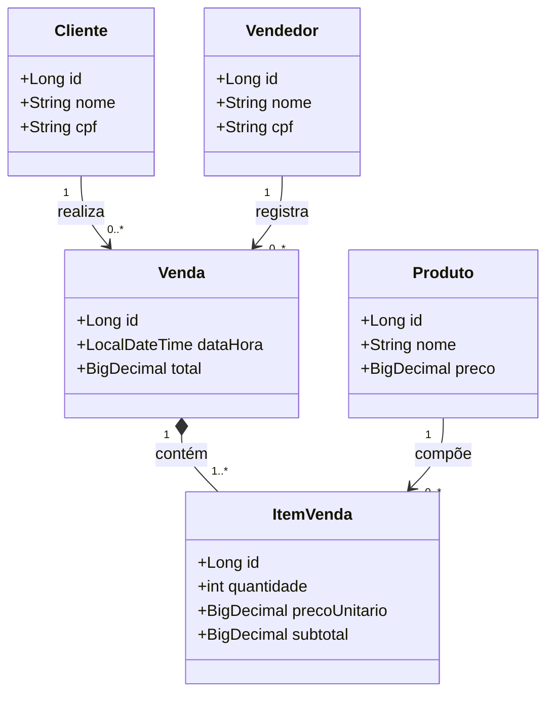
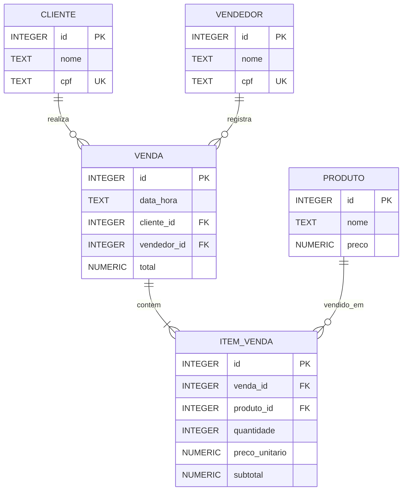

# Sistema de Material de Construção

Aplicação desktop em Java Swing para cadastro e venda de materiais de construção. O projeto usa SQLite local e separa interface, regras de aplicação e persistência no padrão MVC.

## Como executar

Pré-requisito: Java 21 e Maven instalados.

```powershell
mvn test
mvn exec:java
```

Na primeira execução, o banco `data/material_construcao.db` é criado automaticamente.

## Funcionalidades

- Cadastro, alteração e exclusão de clientes, produtos e vendedores.
- Consulta de clientes por nome ou CPF.
- Venda com cliente, vendedor, carrinho de itens e cálculo automático do total.
- Listagem de vendas e visualização dos itens de cada venda.
- Registros ligados a uma venda não podem ser excluídos, preservando o histórico.

## Protótipos das telas

| Tela | Conteúdo e ações |
| --- | --- |
| Hub | Apresentação e botões para todas as telas do sistema. |
| Cadastrar Cliente | Nome e CPF; tabela de registros; ações Salvar, Limpar, Alterar e Excluir. |
| Cadastrar Produto | Nome e preço; tabela de registros; ações Salvar, Limpar, Alterar e Excluir. |
| Cadastrar Vendedor | Nome e CPF; tabela de registros; ações Salvar, Limpar, Alterar e Excluir. |
| Cadastrar Venda | Cliente e vendedor em seletores; produto e quantidade para incluir no carrinho; total e botão Finalizar Venda. |
| Listar Vendas | Tabela com venda, data, cliente, vendedor e total; painel com os itens da venda selecionada. |
| Consultar Clientes | Campo de busca por nome ou CPF e tabela de resultados. |

Todas as telas abertas pelo Hub possuem o botão **Voltar ao Hub**.

## Diagrama de classes



## Diagrama MER



## Estrutura MVC

- `model`: entidades do domínio.
- `dao`: SQL e acesso aos dados SQLite.
- `controller`: validações, regras de venda e coordenação entre telas e dados.
- `view`: telas Java Swing.
